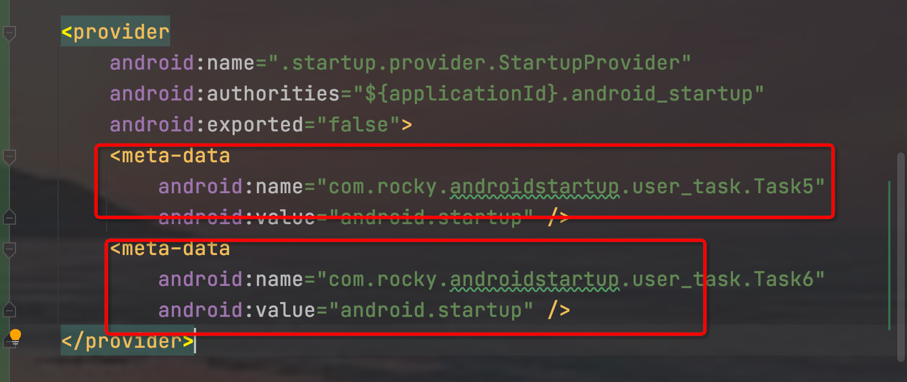

# APP 启动优化 AndroidStartup 框架搭建

## 初步实现任务的管理

### 任务管理

- 依赖管理

    - 创建顶层任务接口
        1. 提供创建的方法
        2. 提供 当前任务依赖的集合
        3. 提供当前任务入度方法
    - 默认实现顶层接口
- 任务排序

  排序的时候 需要借助几张表

    - 入度表

      当前任务执行直线所依赖的所有任务

      Map<Class<? extends Startup>, Integer> inDegreeMap = new HashMap<>();

    - 0度表

      任务执行的队列 所有待执行的任务 都会进出这里

      Deque<Class<? extends Startup>> zeroDeque = new ArrayDeque<>();

    - 原始任务表

      记录所有任务 为排序前的任务

      Map<Class<? extends Startup>, Startup<?>> startupMap = new HashMap<>();

    - 当前任务依赖表

      记录当前任务执行之前 所依赖的所有任务

      Map<Class<? extends Startup>, List<Class<? extends Startup>>> startupChildrenMap = new
      HashMap<>();

## 升级1

### 缓存初始化结果

    第一步可以实现任务的按需执行 但是每一步执行的结果未知
    本次弥补这个劣势 实现任务的执行结果

- 创建结果类

  每一个任务执行的结果数据不一定一直 所以使用泛型保存 在这里没有对结果做任何处理 只是原样保存

- 创建一个缓存管理类

  在这里 保存了一份所有任务执行的结果 因为结果只需一份 所以使用全局单例

  考虑到线程的安全：

      1. 单例使用双重校验 加上volatile 
      2. 缓存使用ConcurrentHashMap

### 封装AndroidStartup

    第一步 直接使用AndroidStartup 可以实现先过但是作为一个框架 显然少了一层封装

- 创建一个Startup管理类

  此处的封装只是 隐藏了Startup的执行过程

    1. 封装提供一个构造 传入上下文和任务列表
    2. 提供一个star方法
    3. 提供一个内部类 Builder 可以使用build 构建实例

## 升级2

### 区分线程

    使用基本功能可以发现 任务只能在同一个线程中执行  要么是主线程 要么是子线程
    那么要是一些任务是需要在子线程处理 一些要在主线程 那么基本功能将受到限制

- 在任务中区分运行的主子线程

  这里处理方式才有了一个小技巧

  给一个已经完成的框架扩展功能使用顶层接口 Dispatcher

- 闭锁

  使用闭锁来控制任务的执行顺序

    1. 在启动管理类中 使用一个闭锁

       这个闭锁是控制主线程是否等待其他任务

    2. 具体任务 使用一个闭锁

       这个闭锁的作用是控制当前任务整体执行完成 包括他的依赖

### 抢占CPU 性能优化

    使用闭锁控制任务执行流程貌似已经做到了很好的优化
    但是 还有一中情况需要考虑下
    加入某个任务是在主线程执行 且需要等待 返回结果 这个样的话 后面的任务一直得不到执行
    这样就会造成资源的浪费 
    解决思路：利用cpu的多核和并发 优先执行线程的任务 这样就避免主线程卡住 子线程得不到执行
    所以 修改排序代码

## 升级3

    本次升级是想把内部任务执行逻辑完全隐藏 只提供一个入口
    
    许多任务的初始化 是在Application中的 这样明显会减慢app的启动

    但是初始化 有只需要一次 并且想初始化完全由框架实现

    思路  使用ContentProvider 前提初始化

- 自定义StartupProvider

  重写onCreate方法----》该方法只会执行一次

- 自定义 StartupInitializer

  获取初始化任务的信息工具类

  在清单文件注册的时候 在provider 节点下声明多个provider 每一个provider一个唯一的key

  一个key对应一个有向无环图的任务链
  
  
